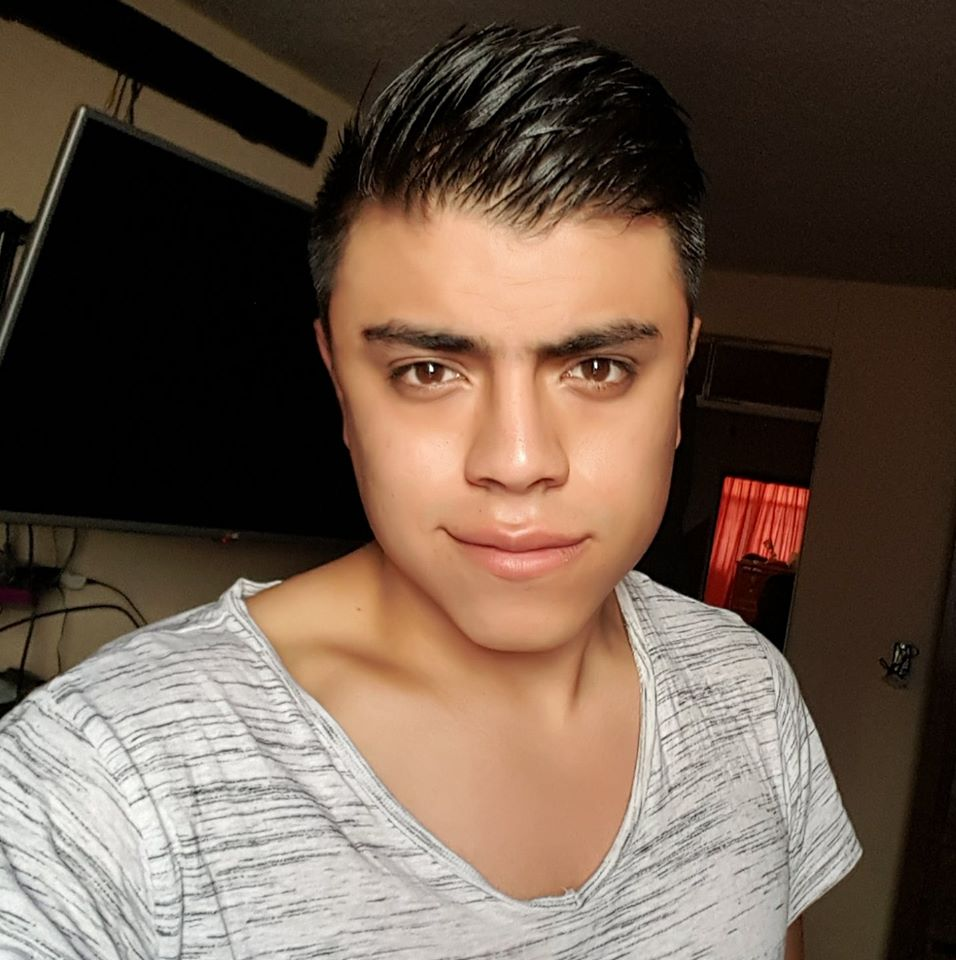
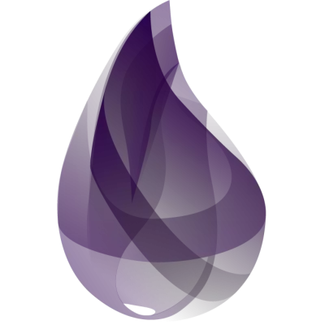

<h1>Hi, I'm Brandon Vergara, Developer Software 🦁</h1>

 </img></h1>

<h2>Something about me 🐉</h2>

- Passion for programming and analysis

- I love learning something new

- I really like challenges

- I like anime

<h2>My Post 💪🏼</h2>

<h2>Languages I've used 🤖</h2>

  
  
  
  
  

<h2>FrameWorks 👾</h2>

  
  
  
  
  

<h2>Tools ☕</h2>

  
  
  
  
  
  
  
  

<h3>GitHub Stats 🦁</h3>
 
  
    
    
